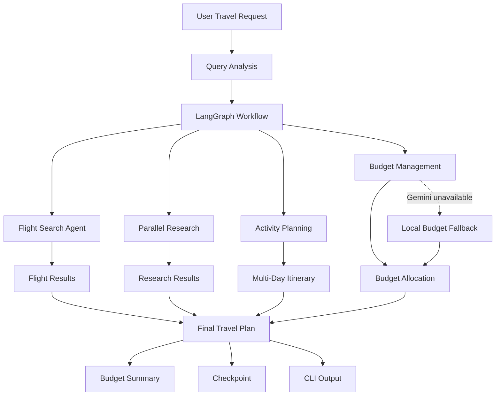

# AI Travel Planner — Gemini + LangGraph

A customized multi-agent travel planning application built on top of the open-source **OpenAI Agents Travel Graph** project by **Bjorn Melin**.

This portfolio version adapts the original architecture for **Google Gemini**, strengthens **LangGraph state handling**, adds **quota-safe fallbacks**, and provides **destination-aware multi-day itinerary generation**.

> **Portfolio Project:** This repository is a customized and extended version of the original project. The original project and its MIT license are credited in the Attribution and License sections below.

---

## ✨ What This Project Does

The application accepts a travel request such as:

```text
Delhi → Jaipur
10 Oct 2026 → 12 Oct 2026
2 travelers
Budget: ₹10,000–₹15,000
```

It then orchestrates specialized stages for:

- Query analysis
- Flight search
- Parallel research
- Activity planning
- Budget management
- Final travel-plan generation

The workflow is coordinated using **LangGraph**.

---

## ⭐ Portfolio Highlights

- Built a multi-stage AI travel-planning workflow using **Google Gemini**
- Orchestrated specialized planning stages using **LangGraph**
- Implemented structured travel-query handling
- Added destination-aware activity generation
- Added multi-day activity rotation
- Implemented budget allocation and planned activity-cost tracking
- Added graceful handling for Gemini `429` and `503` failures
- Implemented deterministic local fallback logic
- Added workflow checkpointing and recovery
- Maintained Python 3.12 compatibility
- **26 automated tests passing**

---

## 🔧 Key Customizations

### 1. Google Gemini Integration

Google Gemini is integrated through its **OpenAI-compatible API interface**, allowing the application to use Gemini models within the existing agent architecture.

### 2. LangGraph Compatibility

Updated workflow construction and state handling for the **LangGraph 0.4.x** architecture.

### 3. Structured Travel Queries

Travel requests are normalized into structured fields including:

- Origin
- Destination
- Departure date
- Return date
- Number of travelers
- Budget range
- Currency

### 4. Activity Model Normalization

Normalized activity objects between internal agent representations and the final **Pydantic travel-plan schema**.

### 5. Destination-Aware Itineraries

Added curated destination-specific activities, including Jaipur examples such as:

- Amber Fort
- City Palace
- Hawa Mahal
- Jal Mahal Viewpoint
- Nahargarh Fort
- Johari Bazaar
- Rajasthani Food Experience

### 6. Multi-Day Activity Rotation

The itinerary generator distributes activities across multiple days instead of repeating the same generic activity list for every day.

### 7. Quota-Safe Gemini Handling

The application detects Gemini quota and temporary service errors such as:

```text
429 RESOURCE_EXHAUSTED
503 Service Unavailable
```

and allows supported workflow stages to continue using fallback logic.

### 8. Local Budget Fallback

When the Gemini budget service is unavailable, the application calculates a deterministic local budget allocation instead of terminating the entire workflow.

### 9. Checkpointed Workflow

The completed workflow is checkpointed so that execution state can be persisted and recovered.

---

## 🏗️ Architecture



### Workflow Overview

```text
User Travel Request
        │
        ▼
┌─────────────────────┐
│   Query Analysis    │
└──────────┬──────────┘
           │
           ▼
┌─────────────────────────────────┐
│       LangGraph Workflow        │
│                                 │
│  Flight Search                  │
│  Parallel Research              │
│  Activity Planning              │
│  Budget Management              │
└───────────────┬─────────────────┘
                │
                ▼
       Final Travel Plan
                │
        ┌───────┴────────┐
        ▼                ▼
   Checkpoint        CLI Output
```

---

## 🛠️ Technology Stack

| Technology | Purpose |
|---|---|
| **Python 3.12** | Application development |
| **LangGraph** | Workflow orchestration |
| **Google Gemini** | LLM-powered planning |
| **Pydantic** | Structured data validation |
| **Supabase** | Persistence / backend services |
| **Tavily** | Search and research |
| **Firecrawl** | Web content extraction |
| **uv** | Dependency and environment management |
| **pytest** | Automated testing |

---

## 🚀 Example

For a Jaipur trip, the planner can generate destination-specific activities such as:

```text
Day 1
  1. Amber Fort
  2. Jal Mahal Viewpoint
  3. Rajasthani Food Experience

Day 2
  1. City Palace
  2. Nahargarh Fort Sunset
  3. Rajasthani Food Experience

Day 3
  1. Hawa Mahal
  2. Johari Bazaar
  3. Rajasthani Food Experience
```

The activity catalogue also provides planning-cost estimates.

> **Note:** Activity prices shown by the curated catalogue are planning estimates and are not guaranteed live ticket or restaurant prices.

---

## 💰 Budget Management

The application maintains a structured budget summary containing:

- Total budget
- Estimated spend
- Remaining budget
- Category-wise allocation
- Saving recommendations

Example:

```text
Budget Summary

Total Budget:       INR 15000.00
Estimated Spend:    INR 2300.00
Remaining Budget:   INR 12700.00
```

The estimated spend represents **known planned itinerary costs**, rather than transactions that have already been paid.

The category allocation is separate from the estimated itinerary cost.

For example:

```text
Total Budget:        INR 15000
Activities Budget:   INR 2250
Known Activity Cost: INR 2300
```

The activity allocation represents the amount reserved for the category, while the known activity cost represents the costs associated with activities currently included in the itinerary.

---

## 🛡️ Gemini Quota Fallback

The application is designed to **degrade gracefully** when Gemini becomes temporarily unavailable.

For example, when the Gemini API reaches its quota:

```text
Budget agent unavailable; using local budget fallback.
Final plan generated successfully.
```

Instead of terminating the complete workflow, the application uses deterministic local logic for the affected budget stage.

This provides resilience during development when working with limited API quotas.

---

## 📊 Testing

The project has been tested locally using the Delhi → Jaipur travel scenario.

Current test status:

```text
26 passed
```

The workflow successfully reaches:

```text
WorkflowStage.COMPLETE
```

The application also successfully handles Gemini quota exhaustion by switching to local budget fallback logic.

> Live external services remain dependent on their respective API credentials, availability, rate limits, and quotas.

---

## ⚙️ Setup

### 1. Clone the Repository

```powershell
git clone https://github.com/Riyajain1104/ai-travel-planner.git
cd ai-travel-planner
```

### 2. Install Dependencies

Install [uv](https://docs.astral.sh/uv/) if necessary, then run:

```powershell
uv sync
```

### 3. Configure Environment Variables

Create a local `.env` file.

**Never commit `.env` to GitHub.**

Example:

```env
GEMINI_API_KEY=your_key_here
SUPABASE_URL=your_supabase_url
SUPABASE_KEY=your_supabase_key
```

The repository `.gitignore` excludes `.env` and local virtual-environment files.

### 4. Run Tests

```powershell
uv run python -m compileall -q travel_planner
uv run python -m pytest -q
```

### 5. Run the Travel Planner

```powershell
uv run python -m travel_planner.main `
  --origin "Delhi" `
  --destination "Jaipur" `
  --travelers 2 `
  --budget "10000-15000" `
  --departure-date "2026-10-10" `
  --return-date "2026-10-12" `
  --log-level INFO
```

To view available command-line options:

```powershell
uv run python -m travel_planner.main --help
```

---

## 📁 Project Structure

```text
ai-travel-planner/
│
├── travel_planner/
│   ├── agents/              # Specialized AI agents
│   ├── data/                # Data models and persistence
│   ├── orchestration/       # LangGraph workflow and nodes
│   ├── utils/               # Logging, rate limiting and helpers
│   └── main.py              # CLI entry point
│
├── tests/                   # Automated tests
├── docs/                    # Documentation and demonstrations
│
├── .gitignore
├── LICENSE
├── README.md
├── pyproject.toml
└── uv.lock
```

---

## 🎯 What This Project Demonstrates

This project demonstrates practical implementation of:

- Multi-agent AI workflows
- LLM integration
- LangGraph orchestration
- Structured state management
- Pydantic data validation
- API error handling
- Rate limiting
- Graceful degradation
- Deterministic fallback systems
- Workflow checkpointing
- Automated testing
- Destination-aware itinerary generation
- Budget allocation and cost tracking

A key design principle is combining **LLM-powered planning with deterministic application logic** so that the system can continue operating when external AI services become temporarily unavailable.

---

## 📌 Attribution

This project is a customized and extended adaptation of:

**Bjorn Melin — OpenAI Agents Travel Graph**

Original repository:

https://github.com/BjornMelin/openai-agents-travel-graph

The original project describes a multi-agent travel planning system using the **OpenAI Agents SDK** and **LangGraph**.

This repository preserves attribution to the original work while documenting the modifications made in this portfolio version.

---

## 📄 License

The original project is released under the **MIT License**.

The MIT license text and copyright attribution are retained in this repository in:

```text
LICENSE
```

See `LICENSE` for the complete terms.

---

## ⚠️ Disclaimer

Travel prices, activity costs, availability, and recommendations can change.

Information produced by this application should be verified against current provider information before making bookings or financial decisions.
